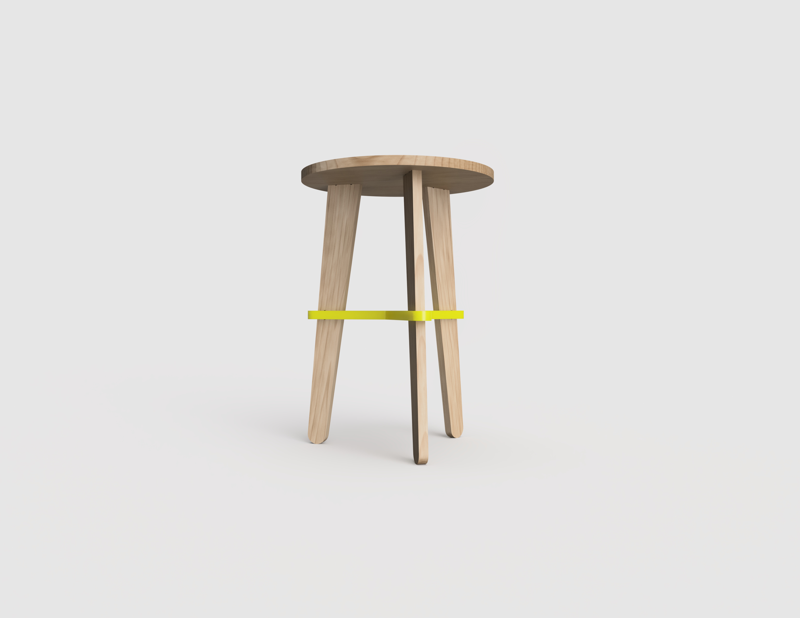

# Grupo dos Pó-Pós!

> Substituam este parágrafo por uma frase de apresentação do grupo (uma linha, conceptualmente forte). A imagem de capa acima (`attachments/hero.jpg`) deve ser uma **fotografia de conjunto** dos trabalhos do grupo, mais conceptual, que espelhe a estratégia coletiva.

## Elementos do Grupo

| Número  | Nome        |
| ------- | ----------- |
| 20XXXXX | André Rocha |
| 20YYYYY | Aluno B     |
| 20ZZZZZ | Aluno C     |

---

## Contexto de Design

Resumo, referências coletivas e moodboard do grupo encontram-se em [contexto.md](contexto.md).

[Ver contexto completo →](contexto.md)

---

## Galeria de Produtos

<!-- Cada thumbnail liga à página individual de cada produto.
     Cada produto vive em produtos/<numero>-<nome>/index.md
     e tem uma sub-página produtos/<numero>-<nome>/processo.md -->

<!-- markdownlint-disable MD033 -->

  <a class="gallery-card" href="produtos/carrinho/">
    
    <h3>Pó-Pó</h3>
    
André Rocha

  </a>
  <a class="gallery-card" href="produtos/banquinho/">
    
    <h3>Sentadinho</h3>
    
André Rocha

  </a>

  <!-- duplicar o bloco acima para cada produto do grupo -->

<!-- markdownlint-enable MD033 -->
