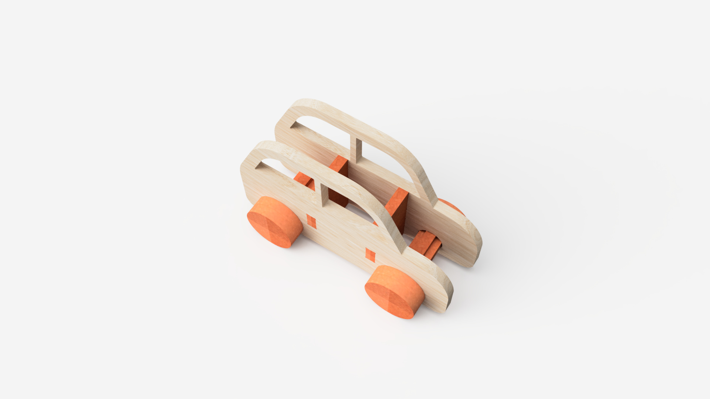

# Nome do Produto

<!--
  HERO: idealmente uma pseudo-sessão fotográfica do produto
  (ver tutorial Pletor.ai nos Recursos da disciplina, em
  /Recursos/AI_exps/). Usa attachments/hero.jpg para o frontmatter.
-->

> Frase-conceito (uma linha): qual é a proposta?

A página deve tornar **visualmente percetível** a estratégia de resposta ao enunciado.
Segue a estrutura de **prancha-resumo** + **esquema-base** (C-E-T-F).

## Conceito

Ideia central do produto. O que é, para quem, porquê.

## Enquadramento

Posicionamento em relação ao contexto de grupo (ver [contexto](../../contexto.md)) e à recolha de objetos a redesenhar.

## Tecnologia

Materiais (espécie de madeira), processos de fabrico (CNC, laser, impressão 3D), software paramétrico, ficheiros técnicos.

- Modelo 3D: <!-- embed Fusion ou link a360.co -->
[https://a360.co/48Iv3K5](https://a360.co/48Iv3K5)
- Ficheiros: `attachments/`

## Função

Como se brinca, idade-alvo, montagem ... (informação visual)

## Apresentação

Imagens-chave que sintetizam o produto final.

---

## Processo

O percurso completo de iterações, modelos e pesquisa está em [processo.md](produtos/20YYXXX_AndreRocha/processo.md), organizado do **mais recente** para o **mais antigo**.

[Ver processo completo →](produtos/20YYXXX_AndreRocha/processo.md)
